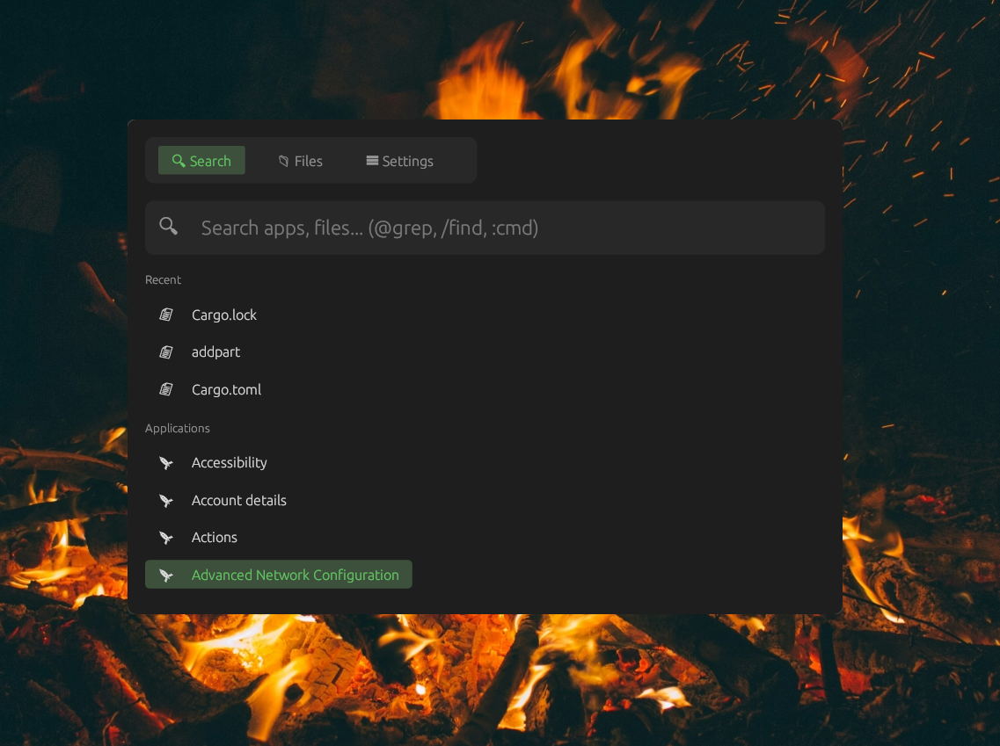

# Filecast

A fast Spotlight/Raycast-style launcher for Linux built with Rust and egui. Features fuzzy search, file browser, grep, and app launching.

<p align="start">
  
</p>

## Features

- **Fuzzy Search** - Smart matching for apps and files (e.g., "vsc" finds "Visual Studio Code")
- **File Browser** - Navigate filesystem with vim-style keybindings
- **Grep Search** - Search file contents with `@pattern`
- **Find Files** - Find files by name with `/pattern`
- **Shell Commands** - Run commands with `:command` in Search or `c` in Files view
- **Clipboard History** - Automatic clipboard tracking with pin and expiry support
- **Global Hotkey** - `Super+Space` to toggle from anywhere
- **Configurable Position** - Place the window where you want it
- **Search Exclusions** - Configurable directory exclusions for search (`~/.config/filecast/search.yaml`)

## Installation

### From .deb Package (Debian/Ubuntu)

Download the latest `.deb` from [Releases](https://github.com/ThembinkosiThemba/filecast/releases) and install:

```bash
cargo install cargo-deb
sudo dpkg -i filecast_*.deb
```

### From Source

```bash
git clone https://github.com/ThembinkosiThemba/filecast.git
cd filecast
cargo build --release
```

The binary will be at `target/release/filecast`.

## Usage

```bash
filecast
```

### Search Syntax (Search View)

| Prefix | Action                    | Example   |
| ------ | ------------------------- | --------- |
| (none) | Fuzzy search apps & files | `firefox` |
| `@`    | Grep file contents        | `@TODO`   |
| `/`    | Find files by name        | `/config` |
| `:`    | Run shell command         | `:ls -la` |

### Keyboard Shortcuts

#### Global

| Key           | Action                               |
| ------------- | ------------------------------------ |
| `Super+Space`   | Toggle Filecast                                  |
| `Ctrl+1/2/3/4`  | Switch views (Search/Files/Clipboard/Settings)   |
| `Escape`        | Clear search / Unfocus / Hide / Back             |

#### Search View

| Key      | Action                                |
| -------- | ------------------------------------- |
| `↑/↓`    | Navigate results                      |
| `Enter`  | Execute / Open selected               |
| `Escape` | Clear search, then unfocus, then hide |

#### Files View

| Key                       | Action                                  |
| ------------------------- | --------------------------------------- |
| `↑/↓` or `j/k`            | Navigate files                          |
| `→` or `l` or `Enter`     | Open file / Enter directory             |
| `←` or `h` or `Backspace` | Go to parent directory                  |
| `r`                       | Refresh directory                       |
| `c`                       | Enter command mode (run shell commands) |
| `Escape`                  | Exit command mode                       |

#### Clipboard View

| Key    | Action                |
| ------ | --------------------- |
| `↑/↓` or `j/k` | Navigate entries |
| `Enter` | Copy selected to clipboard |
| `p`    | Pin / Unpin entry     |
| `d`    | Delete entry          |

Clipboard entries expire after 24 hours unless pinned.

### Views

1. **Search** - Quick search for apps, files, grep, commands
2. **Files** - File browser with vim-style navigation + command execution
3. **Clipboard** - Clipboard history with pin and expiry
4. **Settings** - Configure window position

## Configuration

Settings are stored in `~/.config/filecast/settings.conf`.

### Window Position Options

- Top Center (default)
- Center
- Top Left / Top Right
- Bottom Center / Bottom Left / Bottom Right

## Requirements

- Linux with X11 (for global hotkey)
- Optional: `rg` (ripgrep) for faster grep
- Optional: `fd` for faster file finding

## License

MIT License
